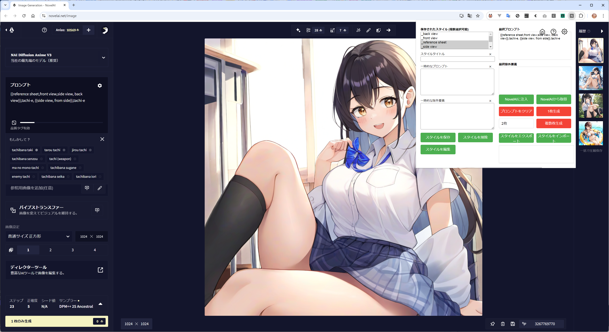

# NaiPrompter

[English](README.md)

NaiPrompterは、NovelAIの画像生成機能を拡張するChrome拡張機能です。プロンプトの管理、保存、そして簡単な再利用を可能にします。

## 目次

- [NaiPrompter](#naiprompter)
  - [目次](#目次)
  - [機能](#機能)
  - [インストール](#インストール)
  - [使い方](#使い方)
  - [設定](#設定)
  - [スタイル](#スタイル)
  - [更新履歴](#更新履歴)
    - [20241015](#20241015)
    - [20240911](#20240911)
  - [ライセンス](#ライセンス)

## 機能

- **複数枚生成**: 指定した枚数の画像を連続して生成できます。
- **プロンプトのクリア**: 現在のプロンプトをクリアします。
- **NovelAI から取得**: 現在NovelAIに設定されているプロンプトを取得します。
- **スタイルのエクスポート/インポート**: スタイルをJSON形式でエクスポート/インポートできます。

より詳細な使用方法については、拡張機能のヘルプアイコンをクリックしてヘルプ画面をご覧ください。

## インストール

1. このリポジトリのリリースにデプロイされているZIPファイルをダウンロードして解凍します。
2. Google Chromeで `chrome://extensions` を開きます。
3. 右上の「デベロッパーモード」をオンにします。
4. 「パッケージ化されていない拡張機能を読み込む」をクリックします。
5. 解凍したフォルダーを選択します。

これで、NovelAI Prompt ManagerがChromeに追加されます。

## 使い方

1. NovelAIのウェブサイトを開きます。
2. Chromeの拡張機能アイコンからNovelAI Prompt Managerを開きます。
3. 「一時的なプロンプト」欄にプロンプトを入力します。
4. 「NovelAIに注入」ボタンをクリックして、入力したプロンプトをNovelAIに適用します。
5. NovelAIの画像生成ボタンをクリックして、画像を生成します。

## 設定

1. 拡張機能のポップアップ右上にある歯車アイコンをクリックして設定画面を開きます。
2. 言語設定：日本語と英語の切り替えが可能です。

## スタイル

スタイル機能を使用すると、よく使うプロンプトの組み合わせを保存し、簡単に呼び出すことができます。

1. 「スタイルタイトル」に名前を入力します。
2. 「一時的なプロンプト」と「一時的な除外要素」にプロンプトを入力します。
3. 「スタイルを保存」ボタンをクリックします。
4. 保存したスタイルは「保存されたスタイル」リストに表示されます。
5. スタイルを選択し、「スタイルを編集」ボタンをクリックすると、そのスタイルの内容を編集できます。

---

ご不明な点や問題がございましたら、イシューを作成してお知らせください。

## 更新履歴
### 20241015
コンソールの追加、複数回実行時の不具合解消、言語対応を英語標準に

### 20240911  
初回リリース向け、基本機能の実装、スタイルの保存と編集削除、複数選択と、一時プロンプトの組み合わせてで速やかなプロンプト作成と、複数回実行を行える機能の追加。

## ライセンス
 
このプロジェクトはMITライセンスでライセンスされています。詳細は[LICENSE](LICENSE)ファイルをご覧ください。
