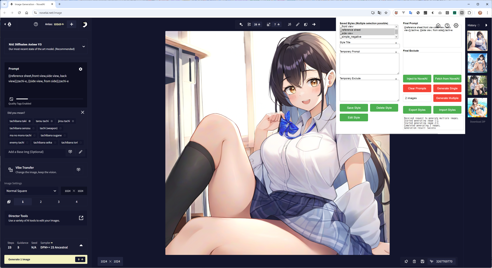

# NaiPrompter

[日本語](README-ja.md)

NaiPrompter is a Chrome extension designed to enhance the user experience of NovelAI by providing additional functionality for image generation.

## Table of Contents
- [NaiPrompter](#naiprompter)
  - [Table of Contents](#table-of-contents)
  - [Features](#features)
  - [Installation](#installation)
  - [Usage](#usage)
  - [Contributing](#contributing)
  - [Changelog](#changelog)
    - [20241015](#20241015)
    - [20240911](#20240911)
  - [License](#license)

## Features

- Generate multiple images at once
- Save and manage custom styles
- Temporary prompt and exclusion settings
- Import and export styles

## Installation

1.  Download and unzip the ZIP file deployed in this repository release.
2. Open Chrome and go to `chrome://extensions/`
3. Enable "Developer mode" in the top right corner
4. Click "Load unpacked" and select the folder containing the extension files
 
For more detailed usage instructions, please click on the help icon for the extension and view the help screen.

## Usage

1. Click on the NaiPrompter icon in your Chrome toolbar
2. Set the number of images you want to generate
3. Click "Generate" to start the process

## Contributing

Contributions are welcome! Please feel free to submit a Pull Request.

## Changelog

### 20241015
Addition of a console, resolution of problems when running multiple times, and language support for English as standard

### 20240911  
For the first release, implementation of basic functions, saving and editing/deleting of styles, multiple selections and the ability to combine temporary prompts for quick prompt creation and multiple runs.

## License

This project is licensed under the MIT License - see the [LICENSE](LICENSE) file for details.
